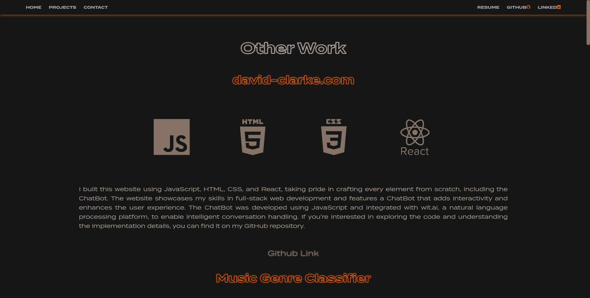

# Portfolio Website

This is the repository for my personal portfolio website, built from scratch using JavaScript, HTML, CSS, React, and PHP. The website is designed to showcase my projects, provide information about me and my experience, and serve as a means of contact.

My portfolio has been featured in Emma Bostian's [developer-portfolios](https://github.com/emmabostian/developer-portfolios).

## Features

- **Mobile Responsive**: The website is designed to work seamlessly across various screen sizes, ensuring a great user experience on both desktop and mobile devices.

- **Navbar**: A consistent navigation bar is present throughout the website, providing links to the homepage, projects, contact form, GitHub profile, resume, and LinkedIn profile.

- **Router**: The website utilizes React Router to create different pages for project write-ups, allowing visitors to explore detailed information about my projects.

- **Contact Form**: The contact form enables visitors to get in touch with me. It utilizes the Brevo API and PHP to send an email containing the contact form data to my specified email address.

- **Chatbot**: I have created a chatbot from scratch using the Wit.ai API. The chatbot responds with information regarding me, my experience, and projects. Please note that the chatbot is only available on desktop devices.

- **Custom Styling and Animations**: The website's style and layout have been personally designed by me using CSS. It includes animations to create an engaging user interface.

- **Skills Section**: The website features a skills section that highlights the languages I am proficient in. Clicking on each skill triggers a React modal, providing a detailed write-up about each skill.

- **404 Page**: A 404 page has been added for any non-existing pages.

- **Scroll Function**: Added a scroll prompt so the user knows there is more to see on the landing page. This can also be clicked to send the user to the project section on desktop and the about section on mobile. Once the user has scrolled from the top, it will change to a scroll to top button that the user can click to navigate to the top of the page.

## Getting Started

To run this portfolio website locally, follow these steps:

1. Clone the repository: `git clone https://github.com/your-username/portfolio.git`
2. Navigate to the project directory: `cd portfolio`
3. Install the dependencies: `npm install`
4. Start the development server: `npm start`
5. Open your web browser and visit `http://localhost:3000` to view the website.

## Dependencies

The following dependencies are used in this project:

- React: A JavaScript library for building user interfaces.
- React Router: A routing library for React that enables navigation between different pages.
- React Modal: A library for creating modal interfaces.
- Brevo API: An API used to send emails from the contact form.
- PHP: A server-side scripting language used to process the contact form data and send emails.
- Wit.ai API: An API used to create the chatbot and provide responses based on user queries.

Make sure to have these dependencies installed and configured correctly before running the website.
